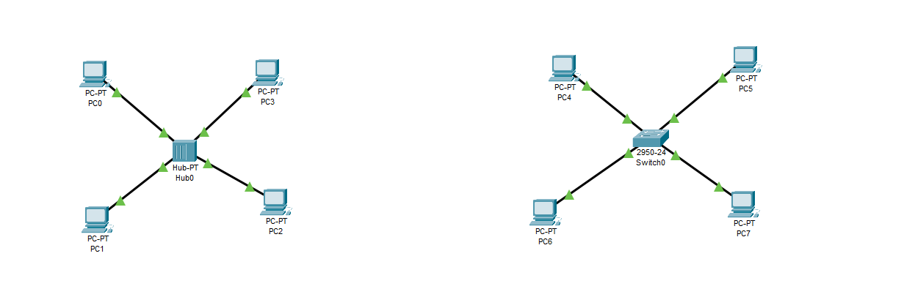

---
## Front matter
lang: ru-RU
title: Лабораторная работа №1
subtitle: Знакомство с Cisco Packet Tracer
author:
  - Хватов М.Г.
institute:
  - Российский университет дружбы народов, Москва, Россия

## i18n babel
babel-lang: russian
babel-otherlangs: english

## Formatting pdf
toc: false
toc-title: Содержание
slide_level: 2
aspectratio: 169
section-titles: true
theme: metropolis
header-includes:
 - \metroset{progressbar=frametitle,sectionpage=progressbar,numbering=fraction}
 - '\makeatletter'
 - '\beamer@ignorenonframefalse'
 - '\makeatother'
---

# Информация

## Докладчик

:::::::::::::: {.columns align=center}
::: {.column width="70%"}

  * Беличева Дарья Михайловна
  * студентка
  * Российский университет дружбы народов
  * [1032204364@pfur.ru](mailto:1032204364@pfur.ru)

:::
::: {.column width="25%"}

:::
::::::::::::::

## Цель работы

Установить инструмент моделирования конфигурации сети Cisco Packet Tracer, ознакомиться с его интерфейсом.

## Задание

1. Установить на домашнем устройстве Cisco Packet Tracer.

2. Построить простейшую сеть в Cisco Packet Tracer, провести простейшую настройку оборудования.

## Выполнение лабораторной работы

{#fig:001 width=70%}

## Выполнение лабораторной работы

{#fig:002 width=70%}

## Выполнение лабораторной работы

{#fig:003 width=50%}

## Выполнение лабораторной работы

{#fig:004 width=70%}

## Выполнение лабораторной работы

{#fig:005 width=70%}

## Выполнение лабораторной работы

{#fig:007 width=70%}

# Выводы

В процессе выполнения данной лабораторной работы я установил инструмент моделирования конфигурации сети Cisco Packet Tracer, ознакомился с его интерфейсом.