---
## Front matter
lang: ru-RU
title: Лабораторная работа №13
subtitle: Статическая маршрутизация в Интернете. Планирование
author:
  - Хватов М.Г.
institute:
  - Российский университет дружбы народов, Москва, Россия

## i18n babel
babel-lang: russian
babel-otherlangs: english

## Formatting pdf
toc: false
toc-title: Содержание
slide_level: 2
aspectratio: 169
section-titles: true
theme: metropolis
header-includes:
 - \metroset{progressbar=frametitle,sectionpage=progressbar,numbering=fraction}
 - '\makeatletter'
 - '\beamer@ignorenonframefalse'
 - '\makeatother'
---

# Информация

## Докладчик

:::::::::::::: {.columns align=center}
::: {.column width="70%"}

  * Хватов Максим Григорьевич
  * студент
  * Российский университет дружбы народов
  * [1032204364@pfur.ru](mailto:1032204364@pfur.ru)

:::
::: {.column width="25%"}

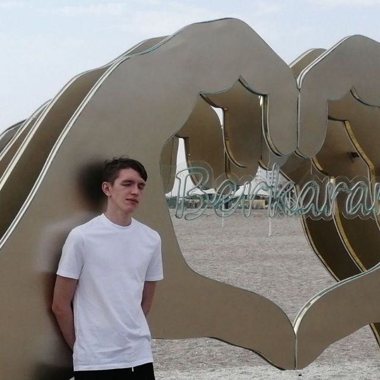

:::
::::::::::::::

# Вводная часть

## Цель работы

Провести подготовительные мероприятия по организации взаимодействия
через сеть провайдера посредством статической маршрутизации локальной
сети с сетью основного здания, расположенного в 42-м квартале в Москве,
и сетью филиала, расположенного в г. Сочи.

## Задание

1. Внести изменения в схемы L1, L2 и L3 сети, добавив в них информацию
о сети основной территории (42-й квартал в Москве) и сети филиала в г. Сочи.
1. Дополнить схему проекта, добавив подсеть основной территории организации 42-го квартала в Москве и подсеть филиала в г. Сочи.
2. Сделать первоначальную настройку добавленного в проект оборудования.
3. При выполнении работы необходимо учитывать соглашение об именовании.

## Выполнение лабораторной работы

: Распределение ip-адресов модельного Интернета {#tbl:ip}

| IP-адреса     | Примечание            |
|---------------|-----------------------|
| 192.0.2.1     | provider-gw-1         |
| 192.0.2.11    | www.yandex.ru         |
| 192.0.2.12    | stud.rudn.university  |
| 192.0.2.13    | esystem.pfur.ru       |
| 192.0.2.14    | www.rudn.ru           |

## Изменение схемы сети

: Таблица VLAN

| № VLAN       | Имя VLAN         | Примечание                                          |
|--------------|------------------|-----------------------------------------------------|
| 5            | q42              | Линк в сеть квартала 42 в Москве                    |
| 6            | sochi            | Линк в сеть филиала в Сочи                          |
| 101          | dk               | Дисплейные классы (ДК)                              |
| 102          | departments      | Кафедры                                             |
| 103          | adm              | Администрация                                       |
| 104          | other            | Для других пользователей                            |
| 201          | q42-main         | Основной для квартала 42 в Москве                   |
| 202          | q42-management   | Для управления устройствами 42-го квартала в Москве |
| 301          | hostel-main      | Основной для общежитий в квартале 42 в Москве       |
| 401          | sochi-main       | Основной для филиала в Сочи                         |

## Изменение схемы сети

: Таблица IP для филиала в г. Сочи

| IP-адреса                        | Примечание                              | VLAN |
|----------------------------------|-----------------------------------------|------|
| 10.130.0.0/16                    | Вся сеть филиала в Сочи                 |      |
| 10.130.0.0/24                    | Основная сеть филиала в Сочи            | 401  |
| 10.130.0.1                       | sch-sochi-gw-1                          |      |
| 10.130.0.200                     | pc-sochi-1                              |      |
| 10.130.1.0/24                    | Сеть для управления устройствами в Сочи | 402  |
| 10.130.1.1                       | sch-sochi-gw-1                          |      |

## Изменение схемы сети

: Таблица IP для связующих разные территории линков
                                                             
| IP-адреса                                         | Примечание                                                   | VLAN |
|---------------------------------------------------|--------------------------------------------------------------|------|
| 10.128.255.0/24                                   | Вся сеть для линков                                          |      |
| 10.128.255.0/30                                   | Линк на 42-й квартал                                         | 5    |
| 10.128.255.1                                      | msk-donskaya-gw-1                                            |      |
| 10.128.255.2                                      | msk-q42-gw-1                                                 |      |
| 10.128.255.4/30                                   | Линк в Сочи 6                                                | 6    |
| 10.128.255.5                                      | msk-donskaya-gw-1                                            |      |
| 10.128.255.6                                      | sch-sochi-gw-1                                               |      |

## Выполнение лабораторной работы

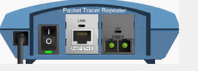{#fig:004 width=70%}

## Выполнение лабораторной работы

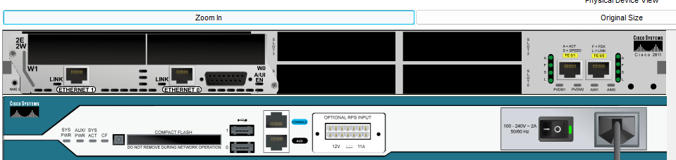{#fig:005 width=70%}

## Выполнение лабораторной работы

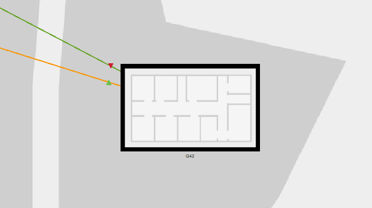{#fig:006 width=70%}

## Выполнение лабораторной работы

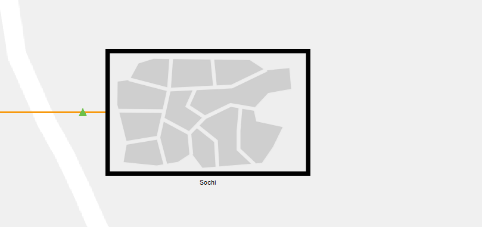{#fig:007 width=70%}

## Выполнение лабораторной работы

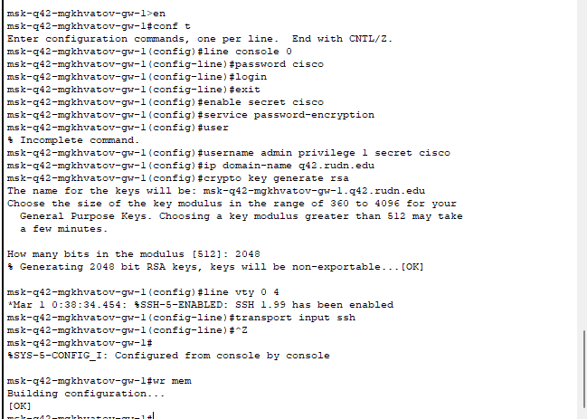{#fig:011 width=70%}

## Выполнение лабораторной работы

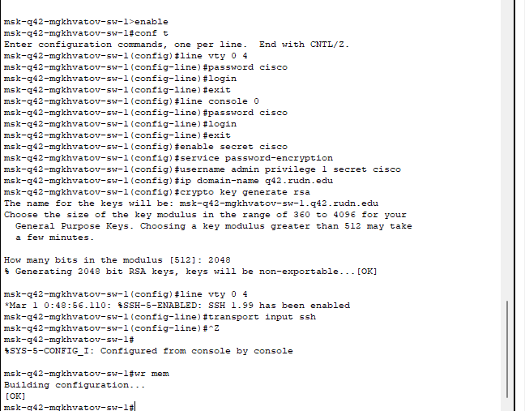{#fig:012 width=70%}

## Выполнение лабораторной работы

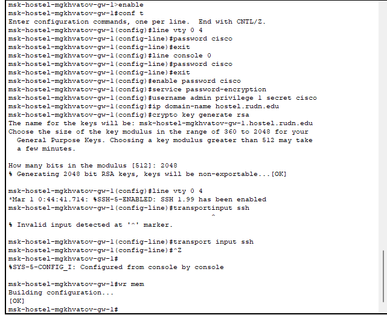{#fig:013 width=70%}

## Выполнение лабораторной работы

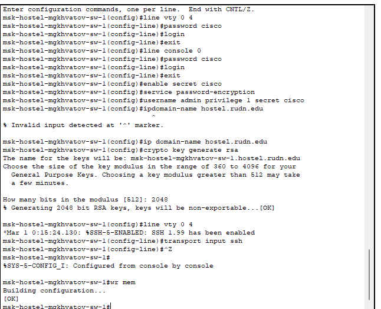{#fig:014 width=70%}

## Выполнение лабораторной работы

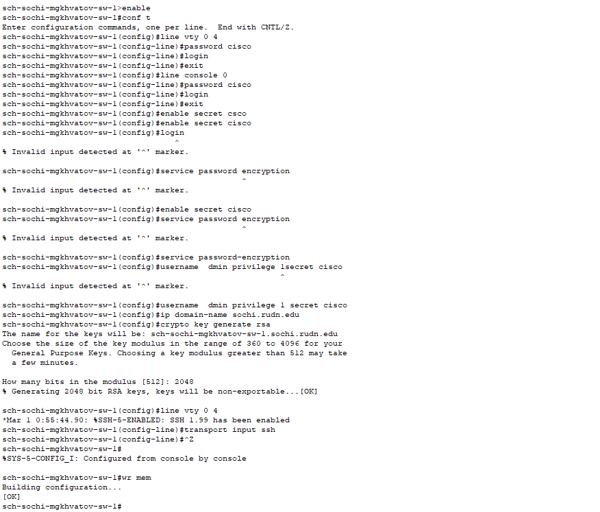{#fig:015 width=70%}

## Выполнение лабораторной работы

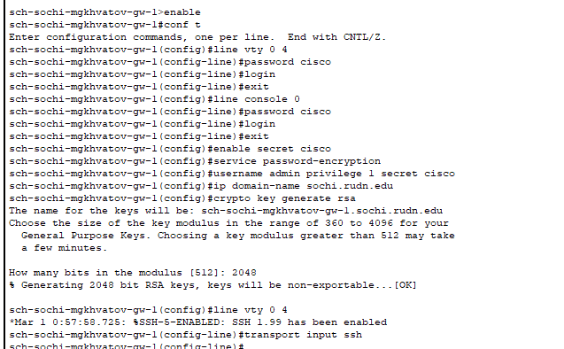{#fig:016 width=70%}

## Выводы

В процессе выполнения лабораторной работы я провел подготовительные мероприятия по организации взаимодействия
через сеть провайдера посредством статической маршрутизации локальной
сети с сетью основного здания, расположенного в 42-м квартале в Москве,
и сетью филиала, расположенного в г. Сочи.