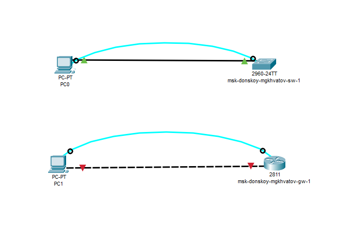
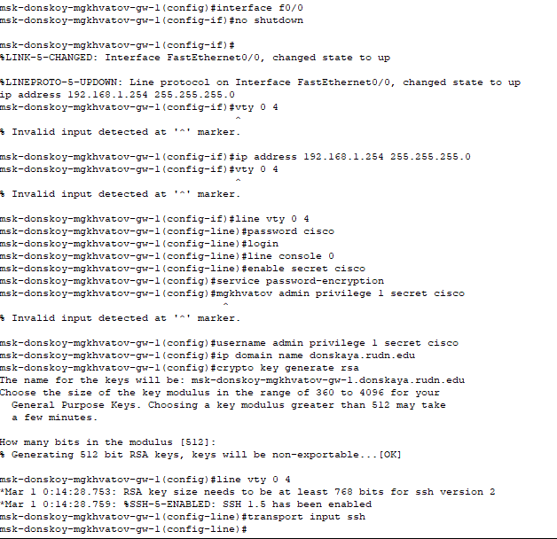
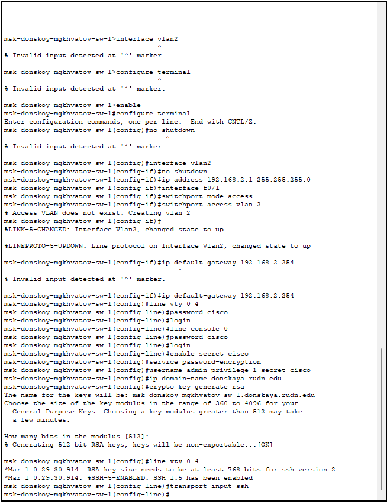

---
## Front matter
title: "Лабораторная работа № 2"
subtitle: "Предварительная настройка оборудования Cisco"
author: "Хватов Максим Григорьевич"

## Generic otions
lang: ru-RU
toc-title: "Содержание"

## Bibliography
bibliography: bib/cite.bib
csl: pandoc/csl/gost-r-7-0-5-2008-numeric.csl

## Pdf output format
toc: true # Table of contents
toc-depth: 2
lof: true # List of figures
lot: false # List of tables
fontsize: 12pt
linestretch: 1.5
papersize: a4
documentclass: scrreprt
## I18n polyglossia
polyglossia-lang:
  name: russian
  options:
	- spelling=modern
	- babelshorthands=true
polyglossia-otherlangs:
  name: english
## I18n babel
babel-lang: russian
babel-otherlangs: english
## Fonts
mainfont: PT Serif
romanfont: PT Serif
sansfont: PT Sans
monofont: PT Mono
mainfontoptions: Ligatures=TeX
romanfontoptions: Ligatures=TeX
sansfontoptions: Ligatures=TeX,Scale=MatchLowercase
monofontoptions: Scale=MatchLowercase,Scale=0.9
## Biblatex
biblatex: true
biblio-style: "gost-numeric"
biblatexoptions:
  - parentracker=true
  - backend=biber
  - hyperref=auto
  - language=auto
  - autolang=other*
  - citestyle=gost-numeric
## Pandoc-crossref LaTeX customization
figureTitle: "Рис."
tableTitle: "Таблица"
listingTitle: "Листинг"
lofTitle: "Список иллюстраций"
lotTitle: "Список таблиц"
lolTitle: "Листинги"
## Misc options
indent: true
header-includes:
  - \usepackage{indentfirst}
  - \usepackage{float} # keep figures where there are in the text
  - \floatplacement{figure}{H} # keep figures where there are in the text
---

# Цель работы

Получить основные навыки по начальному конфигурированию оборудования Cisco.

# Задание

1. Сделать предварительную настройку маршрутизатора:

- задать имя в виде «город-территория-учётная_записьтип_оборудования-номер»;

- задать интерфейсу Fast Ethernet с номером 0 ip-адрес 192.168.1.254 и маску 255.255.255.0, затем поднять интерфейс;

- задать пароль для доступа к привилегированному режиму (сначала в открытом виде, затем — в зашифрованном);

- настроить доступ к оборудованию сначала через telnet, затем — через ssh (используя в качестве имени домена donskaya.rudn.edu);

- сохранить и экспортировать конфигурацию в отдельный файл.

2. Сделать предварительную настройку коммутатора:

- задать имя в виде «город-территория-учётная_записьтип_оборудования-номер» 
 
- задать интерфейсу vlan 2 ip-адрес 192.168.2.1 и маску 255.255.255.0, затем поднять интерфейс;

- привязать интерфейс Fast Ethernet с номером 1 к vlan 2;

- задать в качестве адреса шлюза по умолчанию адрес 192.168.2.254;

- задать пароль для доступа к привилегированному режиму (сначала в открытом виде, затем — в зашифрованном);

- настроить доступ к оборудованию сначала через telnet, затем — через ssh (используя в качестве имени домена donskaya.rudn.edu);

- для пользователя admin задать доступ 1-го уровня по паролю;

- сохранить и экспортировать конфигурацию в отдельный файл.

# Выполнение лабораторной работы

В логической рабочей области Packet Tracer разместим коммутатор, маршрутизатор и 2 оконечных устройства типа PC, соединим один PC
с маршрутизатором консольным и кроссовым кабелем, другой PC — с коммутатором консольным и прямым кабелем (рис. [-@fig:001]).

{#fig:001 width=70%}

## Конфигурация маршрутизатора

Далее провожу конфигурацию маршрутизатора через консоль, вводя команды

{#fig:002 width=70%}

Провожу конфигурирование коммутатора посредством консоли, нажав на его значок

## Конфигурация коммутатора

{#fig:003 width=70%}

# Ответы на вопросы

1. Проводное подключение, беспроводное, удаленное, консольное, через веб-интерфейс, SNMP
2. Рекомендуется использовать категорийные ethernet-кабели из-за высокой скорости передачи данных, стабильного соединения, меньшего влияния помех и долговчности.
3. Рекомендуется использоват ethernet-кабели категории 5e, 6 или 6a из-за тех же причин, что в предыдущем ответе.
4. Нужно использовать оптоволоконные кабели или ethernet из-за высокой скорости передачи данных, устойчивости к помехам, простоты установки
5. Можно использовать SSH, telnet,консольный доступ, web-интерфейс и snmp.
6. SSH, VPN, telenet, web-интерфейс. Предпочтительнее использовать ssh из-за высокого уровня безопасности и простоты настройки.

# Вывод

В прцессе выполнения лабораторной работы я получил навыки по первичному конфигурированию оборудования cisco.