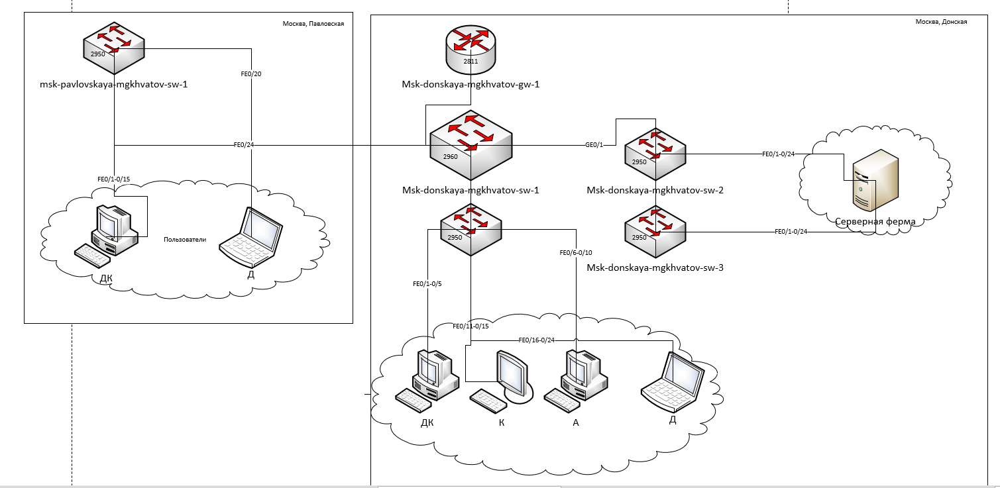
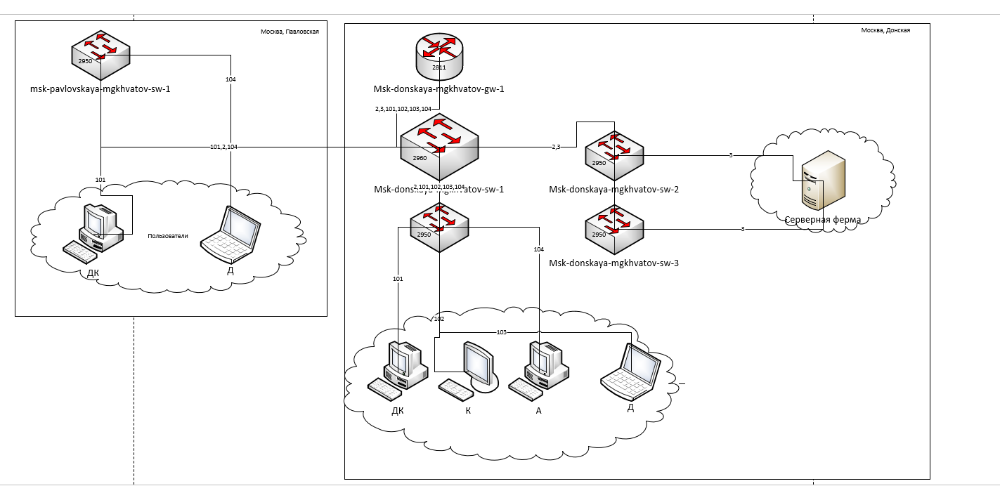
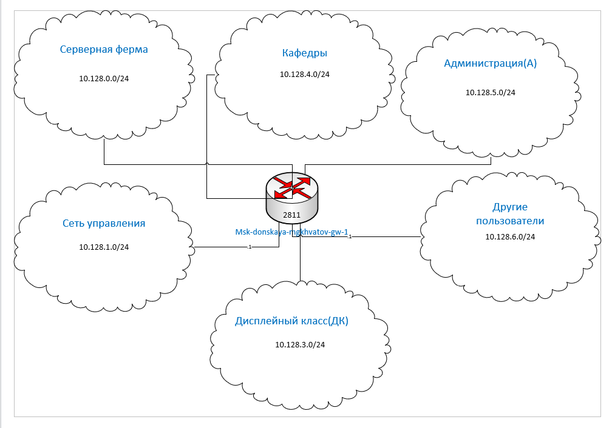
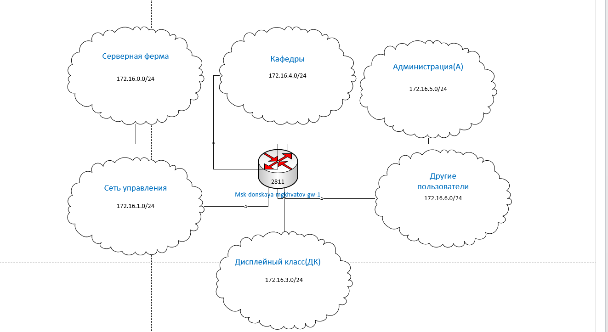
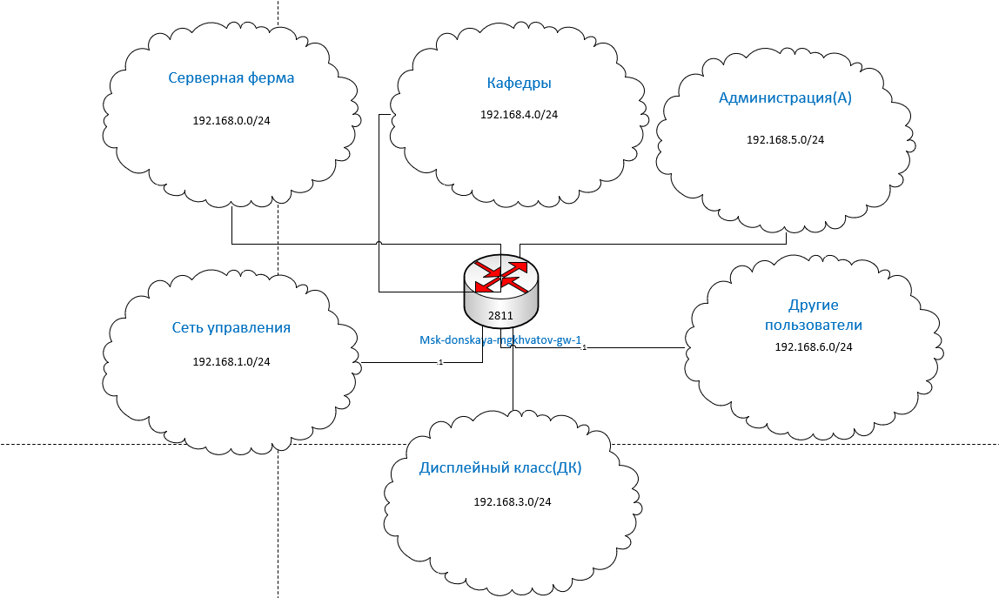

---
## Front matter
title: "Лабораторная работа № 3"
subtitle: "Планирование локальной сети организации"
author: "Хватов Максим Григорьевич"

## Generic otions
lang: ru-RU
toc-title: "Содержание"

## Bibliography
bibliography: bib/cite.bib
csl: pandoc/csl/gost-r-7-0-5-2008-numeric.csl

## Pdf output format
toc: true # Table of contents
toc-depth: 2
lof: true # List of figures
lot: false # List of tables
fontsize: 12pt
linestretch: 1.5
papersize: a4
documentclass: scrreprt
## I18n polyglossia
polyglossia-lang:
  name: russian
  options:
	- spelling=modern
	- babelshorthands=true
polyglossia-otherlangs:
  name: english
## I18n babel
babel-lang: russian
babel-otherlangs: english
## Fonts
mainfont: PT Serif
romanfont: PT Serif
sansfont: PT Sans
monofont: PT Mono
mainfontoptions: Ligatures=TeX
romanfontoptions: Ligatures=TeX
sansfontoptions: Ligatures=TeX,Scale=MatchLowercase
monofontoptions: Scale=MatchLowercase,Scale=0.9
## Biblatex
biblatex: true
biblio-style: "gost-numeric"
biblatexoptions:
  - parentracker=true
  - backend=biber
  - hyperref=auto
  - language=auto
  - autolang=other*
  - citestyle=gost-numeric
## Pandoc-crossref LaTeX customization
figureTitle: "Рис."
tableTitle: "Таблица"
listingTitle: "Листинг"
lofTitle: "Список иллюстраций"
lotTitle: "Список таблиц"
lolTitle: "Листинги"
## Misc options
indent: true
header-includes:
  - \usepackage{indentfirst}
  - \usepackage{float} # keep figures where there are in the text
  - \floatplacement{figure}{H} # keep figures where there are in the text
---

# Цель работы

Познакомиться с принципами планирования локальной сети организации.

# Задание

1. Используя графический редактор (например, Dia), требуется повторить схемы L1, L2, L3, а также сопутствующие им таблицы VLAN, IP-адресов и портов подключения оборудования планируемой сети.

2. Рассмотренный выше пример планирования адресного пространства сети базируется на разбиении сети 10.128.0.0\/16 на соответствующие подсети.
Требуется сделать аналогичный план адресного пространства для сетей 172.16.0.0\/12 и 192.168.0.0\/16 с соответствующими схемами сети и сопутствующими таблицами VLAN, IP-адресов и портов подключения оборудования.

3. При выполнении работы необходимо учитывать соглашение об именовании

# Выполнение лабораторной работы

Для начала сделаем схему планируемой сети с указанием типов и номеров портов подключения устройств, соответствующую физическому уровню модели OSI (L1). Работать будем в графическом редакторе Dia. (рис. [-@fig:001]).

{#fig:001 width=70%}

В качестве оборудования уровня ядра будем использовать маршрутизатор
Cisco 2811, на уровне распределения — коммутаторы Cisco 2960 с возможностью
настройки VLAN, а на уровне доступа — коммутаторы Cisco 2950.

Далее спланируем распределение VLAN [-@tbl:vlan]. Рекомендуется выделять в отдельные подсети (VLAN) устройства управления сетью, а также различные группы пользователей.

:Таблица VLAN {#tbl:vlan}

| № VLAN       | Имя VLAN    | Примечание                  |
|--------------|-------------|-----------------------------|
| 1            | default     | Не используется             |
| 2            | management  | Для управления устройствами |
| 3            | servers     | Для серверной фермы         |
| 4-100        |             | Зарезервировано             |
| 101          | dk          | Дисплейные классы (ДК)      |
| 102          | departamens | Кафедры                     |
| 103          | adm         | Администрация               |
| 104          | other       | Для других пользователей    |

Теперь построим схему сети с указанием номеров VLAN, соответствующую канальному уровню модели OSI (L2) (рис. [-@fig:003]).

{#fig:002 width=70%}

Далее необходимо определить адресное пространство, ассоциированное с выделенными VLAN. Примерная схема сети, соответствующая сетевому уровню модели OSI (L3) (рис. [-@fig:003]).

{#fig:003 width=70%}

Более детальное распределение IP-адресов в сети представлено в табл. [-@tbl:ip]. Сеть 10.128.0.0 является сетью класса А. Маска подсети равна 16, значит могут меняться последние два октета. Разбиваем на сети с маской подсети равной 24, то есть может меняться только последний октет.

:Таблица IP. Сеть 10.128.0.0/16 {#tbl:ip}

| IP-адреса               | Примечание                 | VLAN |
|-------------------------|----------------------------|------|
| 10.128.0.0/16           | Вся сеть                   |      |
| 10.128.0.0/24           | Серверная ферма            | 3    |
| 10.128.0.1              | Шлюз                       |      |
| 10.128.0.2              | Web                        |      |
| 10.128.0.3              | File                       |      |
| 10.128.0.4              | Mail                       |      |
| 10.128.0.5              | Dns                        |      |
| 10.128.0.6-10.128.0.254 | Зарезервировано            |      |
| 10.128.1.0/24           | Управление                 | 2    |
| 10.128.1.1              | Шлюз                       |      |
| 10.128.1.2              | msk-donskaya-sw-1          |      |
| 10.128.1.3              | msk-donskaya-sw-2          |      |
| 10.128.1.4              | msk-donskaya-sw-3          |      |
| 10.128.1.5              | Msk-donskaya-sw-4          |      |
| 10.128.1.6              | msk-pavlovskaya-sw-1       |      |
| 10.128.1.7-10.128.1.254 | Зарезервировано            |      |
| 10.128.2.0/24           | Сеть Point-to-Point        |      |
| 10.128.2.1              | Шлюз                       |      |
| 10.128.2.2-10.128.2.254 | Зарезервировано            |      |
| 10.128.3.0/24           | Дисплейные классы(DK)      | 101  |
| 10.128.3.1              | Шлюз                       |      |
| 10.128.3.2-10.128.3.254 | Пул для пользователей      |      |
| 10.128.4.0/24           | Кафедра (DEP)              | 102  |
| 10.128.4.1              | Шлюз                       |      |
| 10.128.4.2-10.128.4.254 | Пул для пользователей      |      |
| 10.128.5.0/24           | Администрация (ADM)        | 103  |
| 10.128.5.1              | Шлюз                       |      |
| 10.128.5.2-10.128.5.254 | Пул для пользователей      |      |
| 10.128.6.0/24           | Другие пользователи(OTHER) | 104  |
| 10.128.6.1              | Шлюз                       |      |
| 10.128.6.2-10.128.6.254 | Пул для пользователей      |      |

В табл. [-@tbl:fiz] приведён план подключения оборудования сети по портам.

:Таблица портов {#tbl:fiz}

| Устройство                       | Порт        | Примечание           | Access VLAN | Trunk VLAN               |
|----------------------------------|-------------|----------------------|-------------|--------------------------|
| msk-donskaya-mgkhvatov-gw-1      | f0/1        | UpLink               |             |                          |
|                                  | f0/0        | msk-donskaya-sw-1    |             | 2, 3, 101, 102, 103, 104 |
| msk-donskaya-mgkhvatov-sw-1      | f0/24       | msk-donskaya-gw-1    |             | 2, 3, 101, 102, 103, 104 |
|                                  | g0/1        | msk-donskaya-sw-2    |             | 2, 3                     |
|                                  | g0/2        | msk-donskaya-sw-4    |             | 2, 101, 102, 103, 104    |
|                                  | g0/1        | msk-pavlovskaya-sw-1 |             | 2, 101, 104              |
| msk-donskaya-mgkhvatov-sw-2      | g0/1        | msk-donskaya-sw-1    |             | 2, 3                     |
|                                  | g0/2        | msk-donskaya-sw-3    |             | 2, 3                     |
|                                  | f0/1        | Web-server           | 3           |                          |
|                                  | f0/2        | File-server          | 3           |                          |
| msk-donskaya-mgkhvatov-sw-3      | g0/1        | msk-donskaya-sw-2    |             | 2, 3                     |
|                                  | f0/1        | Mail-server          | 3           |                          |
|                                  | f0/2        | Dns-server           | 3           |                          |
| msk-donskaya-mgkhvatov-sw-4      | g0/1        | msk-donskaya-sw-1    |             | 2, 101, 102, 103, 104    |
|                                  | f0/1–f0/5   | dk                   | 101         |                          |
|                                  | f0/6–f0/10  | departments          | 102         |                          |
|                                  | f0/11–f0/15 | adm                  | 103         |                          |
|                                  | f0/16–f0/24 | other                | 104         |                          |
| msk-pavlovskaya-mgkhvatov-sw-1   | f0/24       | msk-donskaya-sw-1    |             | 2, 101, 104              |
|                                  | f0/1–f0/15  | dk                   | 101         |                          |
|                                  | f0/20       | other                | 104         |                          | 

Регламент выделения ip-адресов дан в табл. [-@tbl:reg].

:Регламент выделения ip-адресов (для сети класса C) {#tbl:reg}

| IP-адреса | Назначение           |
|-----------|----------------------|
| 1         | Шлюз                 |
| 2–19      | Сетевое оборудование |
| 20–29     | Серверы              |
| 30–199    | Компьютеры, DHCP     |
| 200–219   | Компьютеры, Static   |
| 220–229   | Принтеры             |
| 230–254   | Резерв               |

Выполним аналогичную планировку сети для двух других частных сетей: 172.16.0.0/12 (сеть класса B) и 192.168.0.0/16 (сеть класса C). Физический и канальный уровни останутся неизменными, нам необходимо поменять только сетевой уровень (L3). Схемы маршрутизации для этих сетей представлены на рисунках [-@fig:004] и [-@fig:005]. 

{#fig:004 width=70%}

{#fig:005 width=70%}

В табл. [-@tbl:ip2] и табл. [-@tbl:ip3] представлены схемы маршрутизации для двух сетей. Мы изменили только первые два байта (октета), поскольку в этих сетях мы можем выделить подсеть с маской 255.255.255.0 (/24), как и в случае сети 10.128.0.0/16.

:Таблица IP. Сеть 172.16.0.0/12 {#tbl:ip2}

| IP-адреса               | Примечание                 | VLAN |
|-------------------------|----------------------------|------|
| 172.16.0.0/12           | Вся сеть                   |      |
| 172.16.0.0/24           | Серверная ферма            | 3    |
| 172.16.0.1              | Шлюз                       |      |
| 172.16.0.2              | Web                        |      |
| 172.16.0.3              | File                       |      |
| 172.16.0.4              | Mail                       |      |
| 172.16.0.5              | Dns                        |      |
| 172.16.0.6-172.16.0.254 | Зарезервировано            |      |
| 172.16.1.0/24           | Управление                 | 2    |
| 172.16.1.1              | Шлюз                       |      |
| 172.16.1.2              | msk-donskaya-sw-1          |      |
| 172.16.1.3              | msk-donskaya-sw-2          |      |
| 172.16.1.4              | msk-donskaya-sw-3          |      |
| 172.16.1.5              | Msk-donskaya-sw-4          |      |
| 172.16.1.6              | msk-pavlovskaya-sw-1       |      |
| 172.16.1.7-172.16.1.254 | Зарезервировано            |      |
| 172.16.2.0/24           | Сеть Point-to-Point        |      |
| 172.16.2.1              | Шлюз                       |      |
| 172.16.2.2-172.16.2.254 | Зарезервировано            |      |
| 172.16.3.0/24           | Дисплейные классы(DK)      | 101  |
| 172.16.3.1              | Шлюз                       |      |
| 172.16.3.2-172.16.3.254 | Пул для пользователей      |      |
| 172.16.4.0/24           | Кафедра (DEP)              | 102  |
| 172.16.4.1              | Шлюз                       |      |
| 172.16.4.2-172.16.4.254 | Пул для пользователей      |      |
| 172.16.5.0/24           | Администрация (ADM)        | 103  |
| 172.16.5.1              | Шлюз                       |      |
| 172.16.5.2-172.16.5.254 | Пул для пользователей      |      |
| 172.16.6.0/24           | Другие пользователи(OTHER) | 104  |
| 172.16.6.1              | Шлюз                       |      |
| 172.16.6.2-172.16.6.254 | Пул для пользователей      |      |

:Таблица IP. Сеть 192.168.0.0/16 {#tbl:ip3}

| IP-адреса                 | Примечание                 | VLAN |
|---------------------------|----------------------------|------|
| 192.168.0.0/16            | Вся сеть                   |      |
| 192.168.0.0/24            | Серверная ферма            | 3    |
| 192.168.0.1               | Шлюз                       |      |
| 192.168.0.2               | Web                        |      |
| 192.168.0.3               | File                       |      |
| 192.168.0.4               | Mail                       |      |
| 192.168.0.5               | Dns                        |      |
| 192.168.0.6-192.168.0.254 | Зарезервировано            |      |
| 192.168.1.0/24            | Управление                 | 2    |
| 192.168.1.1               | Шлюз                       |      |
| 192.168.1.2               | msk-donskaya-sw-1          |      |
| 192.168.1.3               | msk-donskaya-sw-2          |      |
| 192.168.1.4               | msk-donskaya-sw-3          |      |
| 192.168.1.5               | Msk-donskaya-sw-4          |      |
| 192.168.1.6               | msk-pavlovskaya-sw-1       |      |
| 192.168.1.7-192.168.1.254 | Зарезервировано            |      |
| 192.168.2.0/24            | Сеть Point-to-Point        |      |
| 192.168.2.1               | Шлюз                       |      |
| 192.168.2.2-192.168.2.254 | Зарезервировано            |      |
| 192.168.3.0/24            | Дисплейные классы(DK)      | 101  |
| 192.168.3.1               | Шлюз                       |      |
| 192.168.3.2-192.168.3.254 | Пул для пользователей      |      |
| 192.168.4.0/24            | Кафедра (DEP)              | 102  |
| 192.168.4.1               | Шлюз                       |      |
| 192.168.4.2-192.168.4.254 | Пул для пользователей      |      |
| 192.168.5.0/24            | Администрация (ADM)        | 103  |
| 192.168.5.1               | Шлюз                       |      |
| 192.168.5.2-192.168.5.254 | Пул для пользователей      |      |
| 192.168.6.0/24            | Другие пользователи(OTHER) | 104  |
| 192.168.6.1               | Шлюз                       |      |
| 192.168.6.2-192.168.6.254 | Пул для пользователей      |      |

# Вывод

В процессе выполнения лабораторной работы я познакомился с принципами планирования локальной сети организации

# Ответы на контрольные вопросы

1. Модель OSI (Open Systems Interconnection) — это семиуровневая сетевая модель, используемая для стандартизации взаимодействия сетевых устройств.
Уровни OSI и их функции:

  1. Физический (Physical) – передача битов по физическому каналу связи.
  2. Канальный (Data Link) – обеспечение надежной передачи данных между соседними узлами.
  3. Сетевой (Network) – маршрутизация и логическая адресация (IP-адреса).
  4. Транспортный (Transport) – контроль передачи данных (TCP, UDP).
  5. Сеансовый (Session) – установление, поддержание и разрыв соединения.
  6. Представления (Presentation) – кодирование, шифрование, сжатие данных.
  7. Прикладной (Application) – интерфейсы для приложений (HTTP, FTP, SMTP и т. д.).

2. Коммутатор (switch) работает на канальном уровне OSI и выполняет следующие функции:
Передача данных между устройствами в одной локальной сети (LAN).
Использование MAC-адресов для коммутации кадров.
Создание коммутационной таблицы (таблицы MAC-адресов).
Уменьшение коллизий за счет передачи данных только нужному получателю.

3. Маршрутизатор (router) работает на сетевом уровне OSI и выполняет:
Маршрутизацию пакетов между разными сетями.
Выбор оптимального пути передачи данных (протоколы OSPF, RIP, BGP).
Обеспечение NAT, DHCP, фильтрации пакетов (межсетевой экран).

4. Коммутатор 2 уровня (L2 Switch) работает только с MAC-адресами.
Коммутатор 3 уровня (L3 Switch) поддерживает маршрутизацию на основе IP-адресов, объединяя функции коммутатора и маршрутизатора.

5. Сетевой интерфейс — это программное или аппаратное средство, обеспечивающее взаимодействие устройства с сетью (например, Ethernet-карта, Wi-Fi-адаптер).

6. В аппаратном смысле: разъём на устройстве (например, RJ-45 для Ethernet).
В программном смысле: логическая точка взаимодействия (например, порт 80 для HTTP, 443 для HTTPS).

7. Ethernet (10 Мбит/с) – базовая технология передачи данных.
Fast Ethernet (100 Мбит/с) – улучшенная версия с большей скоростью.
Gigabit Ethernet (1 Гбит/с) – значительно увеличенная пропускная способность, используется в современных сетях.

8. IP-адрес – уникальный числовой идентификатор устройства в сети (например, 192.168.1.1).
Сеть – группа устройств, объединённых одним адресным пространством.
Подсеть – логическое деление сети для эффективного управления.
Маска подсети – определяет, какая часть IP-адреса относится к сети, а какая – к узлам (например, 255.255.255.0).
Служебные адреса:
0.0.0.0 – неопределённый адрес.
127.0.0.1 – loopback (локальный хост).
255.255.255.255 – широковещательный адрес.
Пример разбиения сети:
Сеть 192.168.1.0/24 можно разделить на две подсети:
192.168.1.0/25 (128 узлов)
192.168.1.128/25 (128 узлов)

9. VLAN (Virtual Local Area Network) – технология разделения физической сети на логические сегменты.
Применение:
Разделение трафика между отделами (например, HR, IT, бухгалтерия).
Повышение безопасности (данные разных VLAN изолированы).
Уменьшение нагрузки на сеть (меньше широковещательного трафика).
Пример:
В компании можно создать VLAN для бухгалтерии (192.168.1.0/24) и VLAN для IT (192.168.2.0/24), чтобы они не мешали друг другу.

10. Access Port – порт, подключённый к конечному устройству (например, ПК), передающий данные одной VLAN.
Trunk Port – порт, передающий данные нескольких VLAN, использует тегирование (IEEE 802.1Q).
