---
## Front matter
title: "Лабораторная работа № 5"
subtitle: "Конфигурирование VLAN"
author: "Хватов Максим Григорьевич"

## Generic otions
lang: ru-RU
toc-title: "Содержание"

## Bibliography
bibliography: bib/cite.bib
csl: pandoc/csl/gost-r-7-0-5-2008-numeric.csl

## Pdf output format
toc: true # Table of contents
toc-depth: 2
lof: true # List of figures
lot: false # List of tables
fontsize: 12pt
linestretch: 1.5
papersize: a4
documentclass: scrreprt
## I18n polyglossia
polyglossia-lang:
  name: russian
  options:
	- spelling=modern
	- babelshorthands=true
polyglossia-otherlangs:
  name: english
## I18n babel
babel-lang: russian
babel-otherlangs: english
## Fonts
mainfont: PT Serif
romanfont: PT Serif
sansfont: PT Sans
monofont: PT Mono
mainfontoptions: Ligatures=TeX
romanfontoptions: Ligatures=TeX
sansfontoptions: Ligatures=TeX,Scale=MatchLowercase
monofontoptions: Scale=MatchLowercase,Scale=0.9
## Biblatex
biblatex: true
biblio-style: "gost-numeric"
biblatexoptions:
  - parentracker=true
  - backend=biber
  - hyperref=auto
  - language=auto
  - autolang=other*
  - citestyle=gost-numeric
## Pandoc-crossref LaTeX customization
figureTitle: "Рис."
tableTitle: "Таблица"
listingTitle: "Листинг"
lofTitle: "Список иллюстраций"
lotTitle: "Список таблиц"
lolTitle: "Листинги"
## Misc options
indent: true
header-includes:
  - \usepackage{indentfirst}
  - \usepackage{float} # keep figures where there are in the text
  - \floatplacement{figure}{H} # keep figures where there are in the text
---

# Цель работы

Получить основные навыки по настройке VLAN на коммутаторах сети.

# Задание

1. На коммутаторах сети настроить Trunk-порты на соответствующих интерфейсах, связывающих коммутаторы между собой.

2. Коммутатор msk-donskaya-sw-1 настроить как VTP-сервер и прописать на
нём номера и названия VLAN.

3. Коммутаторы msk-donskaya-sw-2 — msk-donskaya-sw-4, mskpavlovskaya-sw-1 настроить как VTP-клиенты, на интерфейсах указать
принадлежность к соответствующему VLAN.

4. На серверах прописать IP-адреса.

5. На оконечных устройствах указать соответствующий адрес шлюза и прописать статические IP-адреса из диапазона соответствующей сети, следуя регламенту выделения ip-адресов.

6. Проверить доступность устройств, принадлежащих одному VLAN, и недоступность устройств, принадлежащих разным VLAN.

7. При выполнении работы необходимо учитывать соглашение об именовании.

# Выполнение лабораторной работы

Откроем файл .pkt, сделанный в предыдущей лабораторной работе, где у нас уже размещены и подключены устройства, и начнем выполнять конфигурацию VLAN.

Используя приведённую в файле лабораторной работы последовательность команд из примера по конфигурации Trunk-порта на интерфейсе g0/1 коммутатора msk-donskaya-sw-1, настроем Trunk-порты на соответствующих интерфейсах всех коммутаторов.(рис. [-@fig:001]).

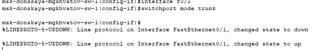{#fig:001 width=70%}

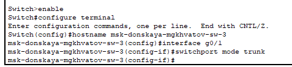{#fig:002 width=70%}

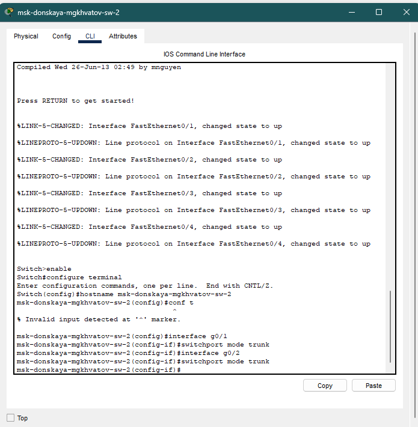{#fig:003 width=70%}

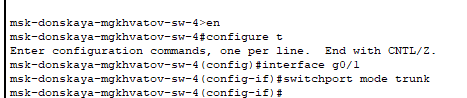{#fig:004 width=70%}

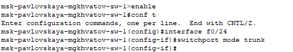{#fig:005 width=70%}

Используя приведённую в лабораторной работе последовательность команд по конфигурации VTP, настроем коммутатор msk-donskaya-sw-1 как VTP-сервер и пропишем на нём номера и названия VLAN. Настроем коммутаторы msk-donskaya-sw-2 — msk-donskaya-sw-4, msk-pavlovskaya-sw-1 как VTP-клиенты.

Сначала зададим список VLAN:

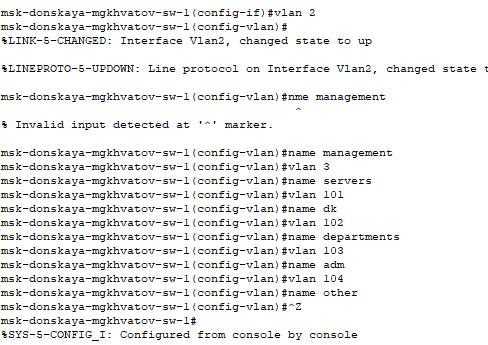{#fig:006 width=70%}

Убедимся, что VLAN заданы, выполнив команду `show vlan`:

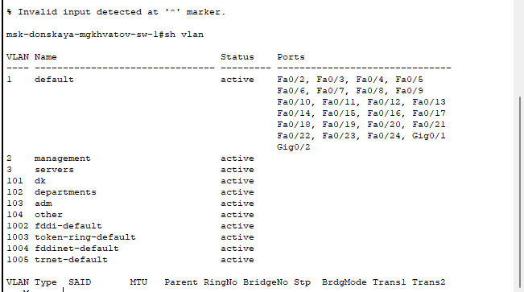{#fig:007 width=70%}

Теперь настроем msk-donskaya-mgkhvatov-sw-1 как VTP-сервер:

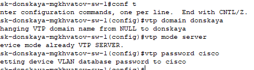{#fig:008 width=70%}

Благодаря протоколу VTP мы можем задать VLAN только на сервере, тогда на клиентах будут отражаться такие же VLAN.

Настроем msk-donskaya-mgkhvatov-sw-2 как VTP-клиент:

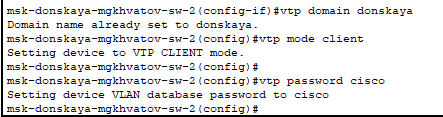{#fig:009 width=70%}

Настроем msk-donskaya-mgkhvatov-sw-3 как VTP-клиент:

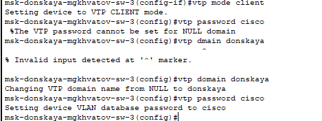{#fig:010 width=70%}

Настроем msk-donskaya-mgkhvatov-sw-4 как VTP-клиент:

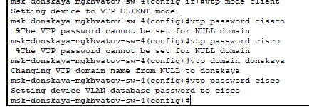{#fig:011 width=70%}

Посмотрим vtp статус, увидим, что у нас подключено 11 VLAN, и устройство является клиентом:

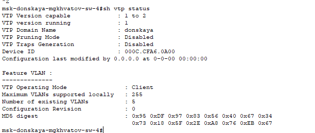{#fig:012 width=70%}

Проверим, что у нас отображаются нужные VLAN:

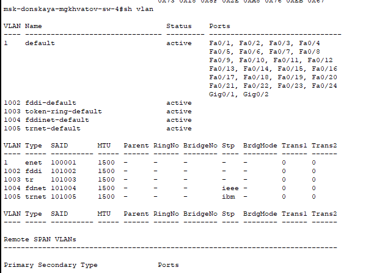{#fig:013 width=70%}

Настроем msk-pavlovskaya-mgkhvatov-sw-1 как VTP-клиент:

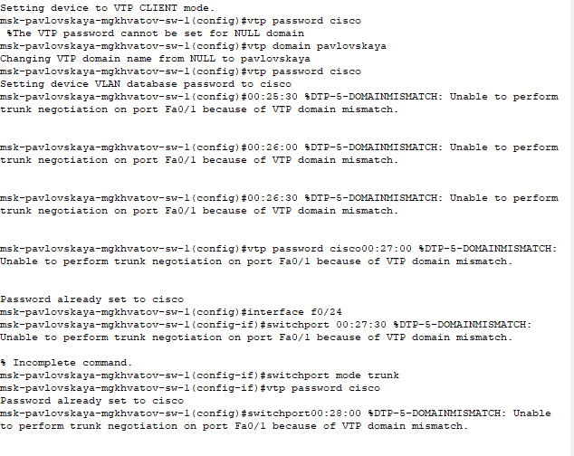{#fig:014 width=70%}

При попытке конфигурироания VTP возникает ошибка о несоответствие доменов, при этом я проверил имена на каждом свитче и там везде установлено нужное имя, поэтому не могу понять из-за чего возникает ошибка и судя по статусу команд sh vtp status, всё должно быть в порядке

# Выводы

В процессе выполнения данной лабораторной работы я получил основные навыки по настройке VLAN на коммутаторах сети.

# Контрольные вопросы

1. Какая команда используется для просмотра списка VLAN на сетевом устройстве?

Команда `show vlan`.

2. Охарактеризуйте VLAN Trunking Protocol (VTP). Приведите перечень
команд с пояснениями для настройки и просмотра информации о VLAN.

Протокол VTP (англ. VLAN Trunking Protocol) — протокол ЛВС, служащий для обмена информацией о VLAN (виртуальных сетях), имеющихся на выбранном транковом порту. Разработан и используется компанией Cisco.

* show vlan — выводит подробный список номеров и имён VLAN, активных на коммутаторе, а также портов, назначенных в каждую из них;

* switchport access vlan vlan_number -  команды для назначения отдельных портов в сети VLAN;

* switchport access vlan vlan_number - команды для назначения диапазонов портов в сети VLAN.

3. Охарактеризуйте Internet Control Message Protocol (ICMP). Опишите формат пакета ICMP.

Протокол Internet Control Message Protocol (ICMP) – это набор коммуникационных правил, которые устройства используют для распространения информации об ошибках передачи данных в сети.
При обмене сообщениями между отправителем и получателем могут возникнуть непредвиденные ошибки. Например, сообщения могут быть слишком длинными или пакеты данных могут приходить не по порядку, поэтому получатель не может их организовать.

Формат пакета ICMP включает следующие поля:

* Идентификатор (обычно это идентификатор процесса) и номер по порядку (увеличивается на 1 при посылке каждого пакета). Эти поля служат для того, чтобы отправитель мог связать в пары запросы и отклики.

* Тип определяет, является ли этот пакет запросом (8) или откликом (0).

* Контрольная сумма представляет собой 16-разрядное дополнение по модулю 1 контрольной суммы всего ICMP-сообщения, начиная с поля тип.

* Данные служит для записи информации, возвращаемой отправителю.

4. Охарактеризуйте Address Resolution Protocol (ARP). Опишите формат
пакета ARP.

ARP - протокол разрешения адресов (Address Resolution Protocol) является протоколом третьего (сетевого) уровня модели OSI, используется для преобразования IP-адресов в MAC-адреса, играет важную функцию в множественном доступе сетей.

Формат сообщения ARP включает следующие поля:

* Тип оборудования. Размер поля равен 2 байтам. Определяет тип оборудования, используемое для передачи сообщения. Наиболее распространённый тип оборудования — Ethernet. Значение Ethernet равно 1.

* Тип протокола. Указывает, какой протокол использовался для передачи сообщения. Значение этого поля равно 2048, что указывает на IPv4.

* Длина аппаратного адреса. Показывает длину сетевого адреса в байтах. Размер MAC-адреса Ethernet составляет 6 байт.

* Длина адреса протокола. Показывает размер IP-адреса в байтах. Размер IP-адреса равен 4 байтам.

* Операционный закон. Указывает тип сообщения. Если значение этого поля равно 1, то это сообщение-запрос, а если значение этого поля равно 2, то это ответное сообщение.

* Аппаратный адрес отправителя. Содержит MAC-адрес устройства, передающего сообщение.

5. Что такое MAC-адрес? Какова его структура?

MAC-адрес — это уникальный код, присвоенный производителем сетевому устройству (например, беспроводному сетевому адаптеру или ethernet-адаптеру). MAC — это сокращение от Media Access Control. Предполагается, что каждый код является уникальным для определённого устройства.
MAC-адрес состоит из шести групп по два символа, разделённых двоеточиями, например, 00:1B:44:11:3A:B7.
   