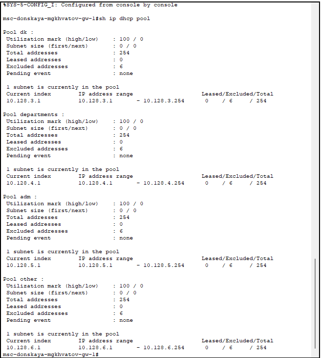

---
## Front matter
title: "Лабораторная работа № 8"
subtitle: "Настройка сетевых сервисов. DHCP"
author: "Хватов Максим Григорьевич"

## Generic otions
lang: ru-RU
toc-title: "Содержание"

## Bibliography
bibliography: bib/cite.bib
csl: pandoc/csl/gost-r-7-0-5-2008-numeric.csl

## Pdf output format
toc: true # Table of contents
toc-depth: 2
lof: true # List of figures
lot: false # List of tables
fontsize: 12pt
linestretch: 1.5
papersize: a4
documentclass: scrreprt
## I18n polyglossia
polyglossia-lang:
  name: russian
  options:
	- spelling=modern
	- babelshorthands=true
polyglossia-otherlangs:
  name: english
## I18n babel
babel-lang: russian
babel-otherlangs: english
## Fonts
mainfont: PT Serif
romanfont: PT Serif
sansfont: PT Sans
monofont: PT Mono
mainfontoptions: Ligatures=TeX
romanfontoptions: Ligatures=TeX
sansfontoptions: Ligatures=TeX,Scale=MatchLowercase
monofontoptions: Scale=MatchLowercase,Scale=0.9
## Biblatex
biblatex: true
biblio-style: "gost-numeric"
biblatexoptions:
  - parentracker=true
  - backend=biber
  - hyperref=auto
  - language=auto
  - autolang=other*
  - citestyle=gost-numeric
## Pandoc-crossref LaTeX customization
figureTitle: "Рис."
tableTitle: "Таблица"
listingTitle: "Листинг"
lofTitle: "Список иллюстраций"
lotTitle: "Список таблиц"
lolTitle: "Листинги"
## Misc options
indent: true
header-includes:
  - \usepackage{indentfirst}
  - \usepackage{float} # keep figures where there are in the text
  - \floatplacement{figure}{H} # keep figures where there are in the text
---

# Цель работы

Приобрести практические навыки по настройке динамического распределения IP-адресов посредством протокола DHCP (Dynamic Host Configuration Protocol) в локальной сети.

# Задание

1. Добавить DNS-записи для домена donskaya.rudn.ru на сервер dns.
2. Настроить DHCP-сервис на маршрутизаторе.
3. Заменить в конфигурации оконечных устройствах статическое распределение адресов на динамическое.
4. При выполнении работы необходимо учитывать соглашение об именовании.

# Выполнение лабораторной работы

В логическую рабочую область проекта добавим сервер dns и подключим
его к коммутатору msk-donskaya-sw-3 через порт Fa0/2 (рис. [-@fig:001]), не забыв
активировать порт при помощи соответствующих команд на коммутаторе (рис. [-@fig:009]).

{#fig:001 width=70%}

{#fig:009 width=70%}

В конфигурации сервера укажем в качестве адреса шлюза 10.128.0.1 (рис. [-@fig:002]),
а в качестве адреса самого сервера — 10.128.0.5 с соответствующей маской
255.255.255.0 (рис. [-@fig:003]).

{#fig:002 width=70%}

{#fig:003 width=70%}

Настроем сервис DNS (рис. [-@fig:004]):

- в конфигурации сервера выберем службу DNS, активируем её (выбрав
флаг On);
- в поле Type в качестве типа записи DNS выберем записи типа A(A Record);
- в поле Name укажем доменное имя, по которому можно обратиться, например, к web-серверу — www.donskaya.rudn.ru, затем укажем его IP-адрес в соответствующем поле 10.128.0.2;
- нажав на кнопку Add , добавьте DNS-запись на сервер;
- аналогичным образом добавим DNS-записи для серверов mail, file, dns согласно распределению адресов из таблицы, сделанной в лабораторной работе №3;
- сохраним конфигурацию сервера.

{#fig:004 width=70%}

Настроем DHCP-сервис на маршрутизаторе, используя приведённые в лабораторной работе №8
команды для каждой выделенной сети(рис. [-@fig:005]): 

- укажем IP-адрес DNS-сервера;
- перейдем к настройке DHCP; 
- зададим название конфигурируемому
диапазону адресов (пулу адресов), укажем адрес сети, а также адреса шлюза и DNS-сервера; 
- зададим пулы адресов, исключаемых из динамического
распределения (см. табл. [-@tbl:reg]).

:Регламент выделения ip-адресов (для сети класса C) {#tbl:reg}

| IP-адреса | Назначение           |
|-----------|----------------------|
| 1         | Шлюз                 |
| 2–19      | Сетевое оборудование |
| 20–29     | Серверы              |
| 30–199    | Компьютеры, DHCP     |
| 200–219   | Компьютеры, Static   |
| 220–229   | Принтеры             |
| 230–254   | Резерв               |

{#fig:005 width=70%}

Посмотрим информацию о настроенных пулах DHCP (рис. [-@fig:007]).

{#fig:007 width=70%}

Также посмотрим информацию о привязках выданных адресов (рис. [-@fig:008]), но пока нет выданных адресов.

{#fig:008 width=70%}

Изначально у нас были заданы статические ip-адреса, можем посмотреть их с помощью команды `ipconfig` (рис. [-@fig:010]).

{#fig:010 width=70%}

Теперь на оконечных устройствах заменим в настройках статическое распределение адресов на динамическое с помощью галочки **DHCP** в настройках.

Проверим доступность устройств из разных подсетей (рис. [-@fig:013], [-@fig:014]). Как видно, пингование проходит успешно.

{#fig:013 width=70%}

{#fig:014 width=70%}

В режиме симуляции изучим, каким образом происходит запрос адреса по
протоколу DHCP (рис. [-@fig:015]) (какие сообщения и какие отклики передаются по сети).

{#fig:015 width=70%}

Я не смог проанализировать запрос DHCP, так как его почему-то не было в меню справа. Были только протоколы STP и ICMP.

# Выводы

В процессе выполнения данной лабораторной работы я приобрел практические навыки по настройке динамического распределения IP-адресов посредством протокола DHCP (Dynamic Host Configuration Protocol) в локальной сети.

# Контрольные вопросы

1. За что отвечает протокол DHCP?

Протокол DHCP — это стандартный протокол, определяемый RFC 1541 (который заменяется RFC 2131), позволяющий серверу динамически распределять IP-адреса и сведения о конфигурации клиентам.

2. Какие типы DHCP-сообщений передаются по сети?

По данным источника, в DHCP-протоколе используются следующие типы сообщений:

* DHCPDISCOVER — клиент отправляет пакет, пытаясь найти сервер DHCP в сети.

* DHCPOFFER — сервер отправляет пакет, включающий предложение использовать уникальный IP-адрес.

* DHCPREQUEST — клиент отправляет пакет с просьбой выдать в аренду предложенный уникальный адрес.

* DHCPACK — сервер отправляет пакет, в котором утверждается запрос клиента на использование IP-адреса.

3. Какие параметры могут быть переданы в сообщениях DHCP?

Параметры DHCP могут включать IP-адреса, шлюзы, DNS-серверы, временные интервалы аренды и другие настройки сети.

4. Что такое DNS?

DNS (Система доменных имён, англ. Domain Name System) — это иерархическая децентрализованная система именования для интернет-ресурсов подключённых к Интернет, которая ведёт список доменных имён вместе с их числовыми IP-адресами или местонахождениями. DNS позволяет перевести простое запоминаемое имя хоста в IP-адрес.

5. Какие типы записи описания ресурсов есть в DNS и для чего они используются? 
 
Основными ресурсными записями DNS являются:

* A-запись — одна из самых важных записей. Именно эта запись указывает на IP-адрес сервера, который привязан к доменному имени.
* MX-запись — указывает на сервер, который будет использован при отсылке доменной электронной почты.
* NS-запись — указывает на DNS-сервер домена.
* CNAME-запись — позволяет одному из поддоменов дублировать DNS-записи своего родителя.