---
## Front matter
lang: ru-RU
title: Лабораторная работа №9
subtitle: Использование протокола STP. Агрегирование каналов
author:
  - Хватов М.Г.
institute:
  - Российский университет дружбы народов, Москва, Россия

## i18n babel
babel-lang: russian
babel-otherlangs: english

## Formatting pdf
toc: false
toc-title: Содержание
slide_level: 2
aspectratio: 169
section-titles: true
theme: metropolis
header-includes:
 - \metroset{progressbar=frametitle,sectionpage=progressbar,numbering=fraction}
 - '\makeatletter'
 - '\beamer@ignorenonframefalse'
 - '\makeatother'
---

# Информация

## Докладчик

:::::::::::::: {.columns align=center}
::: {.column width="70%"}

  * Хватов Максим Григорьевич
  * студент
  * Российский университет дружбы народов
  * [1032204364@pfur.ru](mailto:1032204364@pfur.ru)

:::
::: {.column width="25%"}

:::
::::::::::::::

# Вводная часть

**Цель работы**

Изучить возможности протокола STP и его модификаций по обеспечению
отказоустойчивости сети, агрегированию интерфейсов и перераспределению
нагрузки между ними.

**Задание**

1. Сформировать резервное соединение между коммутаторами msk-donskayasw-1 и msk-donskaya-sw-3.

2. Настроить балансировку нагрузки между резервными соединениями.

3. Настроить режим Portfast на тех интерфейсах коммутаторов, к которым подключены серверы.

4. Изучить отказоустойчивость резервного соединения.

5. Сформировать и настроить агрегированное соединение интерфейсов Fa0/20 -- Fa0/23 между коммутаторами msk-donskaya-sw-1 и msk-donskaya-sw-4.

6. При выполнении работы необходимо учитывать соглашение об именовании.

# Выполнение лабораторной работы

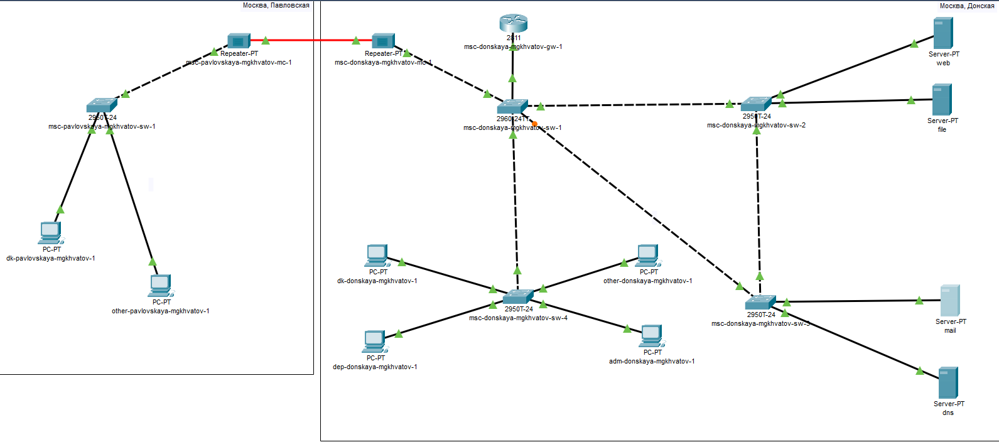{#fig:001 width=70%}

## Выполнение лабораторной работы

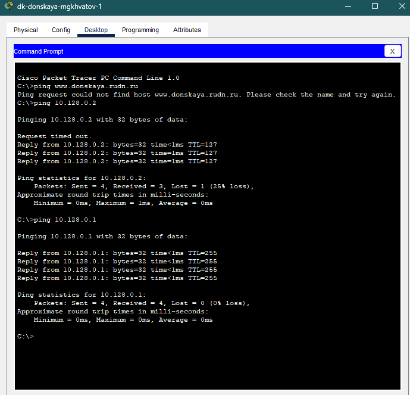{#fig:005 width=70%}

## Выполнение лабораторной работы

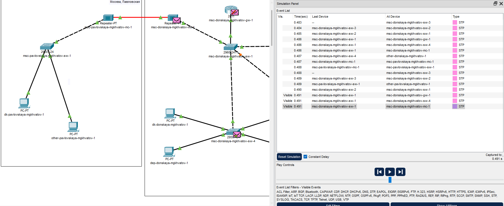{#fig:006 width=70%}

## Выполнение лабораторной работы

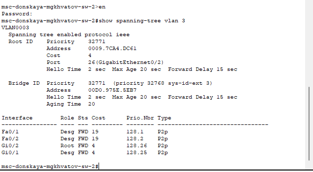{#fig:008 width=70%}

## Выполнение лабораторной работы

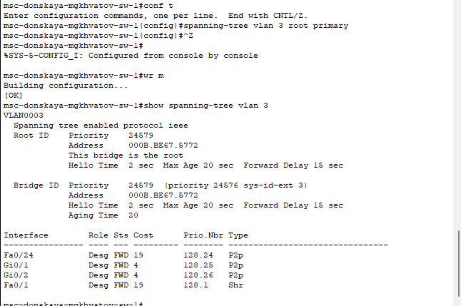{#fig:009 width=70%}

## Выполнение лабораторной работы

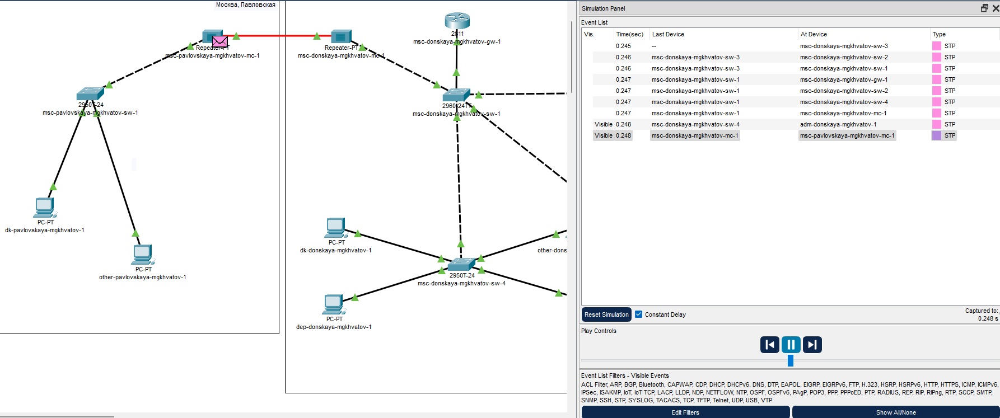{#fig:010 width=70%}

## Выполнение лабораторной работы

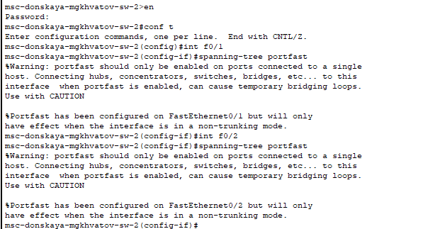{#fig:012 width=70%}

## Выполнение лабораторной работы

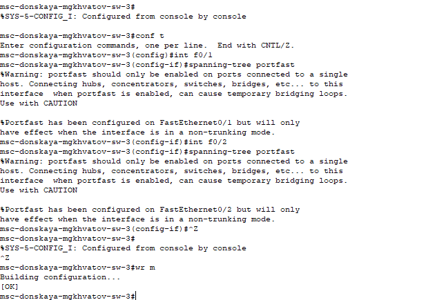{#fig:017 width=70%}

## Выполнение лабораторной работы

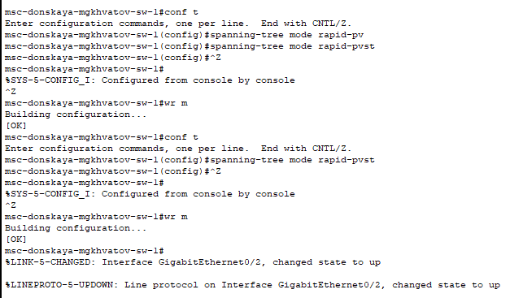{#fig:018 width=70%}

## Выполнение лабораторной работы

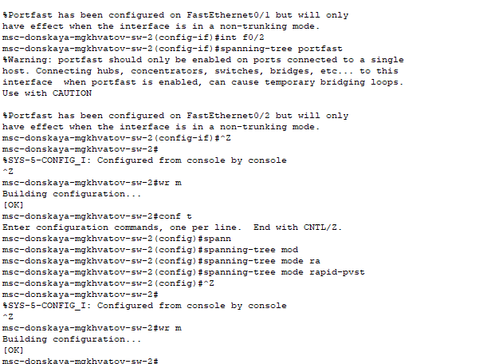{#fig:019 width=70%}

## Выполнение лабораторной работы

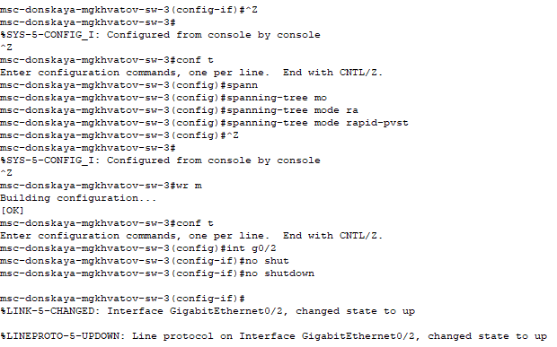{#fig:020 width=70%}

## Выполнение лабораторной работы

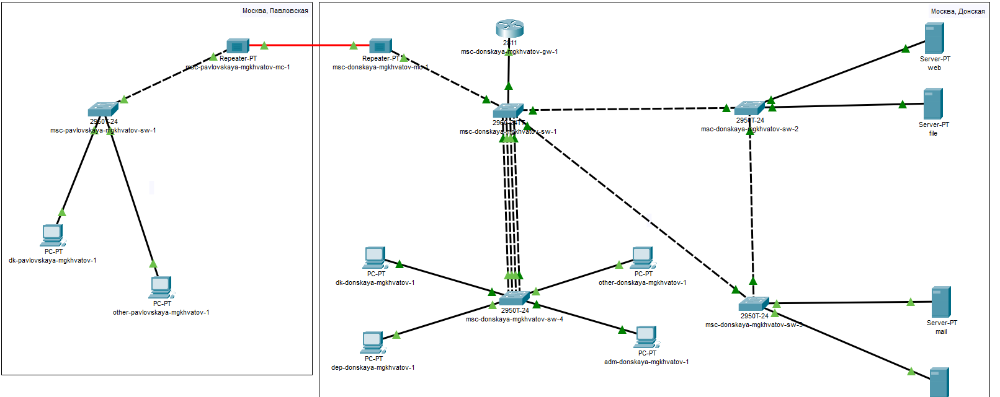{#fig:029 width=70%}

## Выполнение лабораторной работы

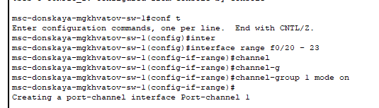{#fig:025 width=70%}

## Выполнение лабораторной работы

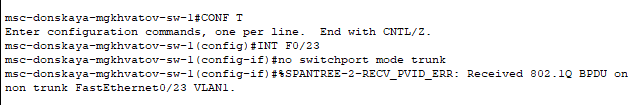{#fig:026 width=70%}

## Выполнение лабораторной работы

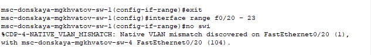{#fig:027 width=70%}

## Выполнение лабораторной работы

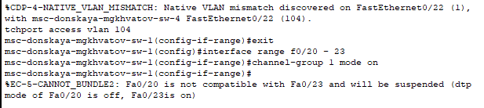{#fig:028 width=70%}

## Выполнение лабораторной работы

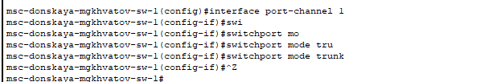{width=70%}

# Выводы

В результате выполнения лабораторной работы я изучил возможности протокола STP и его модификаций по обеспечению
отказоустойчивости сети, агрегированию интерфейсов и перераспределению нагрузки между ними.