---
## Front matter
title: "Лабораторная работа № 9"
subtitle: "Использование протокола STP. Агрегирование каналов"
author: "Хватов Максим Григорьевич"

## Generic otions
lang: ru-RU
toc-title: "Содержание"

## Bibliography
bibliography: bib/cite.bib
csl: pandoc/csl/gost-r-7-0-5-2008-numeric.csl

## Pdf output format
toc: true # Table of contents
toc-depth: 2
lof: true # List of figures
lot: false # List of tables
fontsize: 12pt
linestretch: 1.5
papersize: a4
documentclass: scrreprt
## I18n polyglossia
polyglossia-lang:
  name: russian
  options:
	- spelling=modern
	- babelshorthands=true
polyglossia-otherlangs:
  name: english
## I18n babel
babel-lang: russian
babel-otherlangs: english
## Fonts
mainfont: PT Serif
romanfont: PT Serif
sansfont: PT Sans
monofont: PT Mono
mainfontoptions: Ligatures=TeX
romanfontoptions: Ligatures=TeX
sansfontoptions: Ligatures=TeX,Scale=MatchLowercase
monofontoptions: Scale=MatchLowercase,Scale=0.9
## Biblatex
biblatex: true
biblio-style: "gost-numeric"
biblatexoptions:
  - parentracker=true
  - backend=biber
  - hyperref=auto
  - language=auto
  - autolang=other*
  - citestyle=gost-numeric
## Pandoc-crossref LaTeX customization
figureTitle: "Рис."
tableTitle: "Таблица"
listingTitle: "Листинг"
lofTitle: "Список иллюстраций"
lotTitle: "Список таблиц"
lolTitle: "Листинги"
## Misc options
indent: true
header-includes:
  - \usepackage{indentfirst}
  - \usepackage{float} # keep figures where there are in the text
  - \floatplacement{figure}{H} # keep figures where there are in the text
---

# Цель работы

Изучить возможности протокола STP и его модификаций по обеспечению
отказоустойчивости сети, агрегированию интерфейсов и перераспределению
нагрузки между ними.

# Задание

1. Сформировать резервное соединение между коммутаторами msk-donskayasw-1 и msk-donskaya-sw-3.

2. Настроить балансировку нагрузки между резервными соединениями.

3. Настроить режим Portfast на тех интерфейсах коммутаторов, к которым подключены серверы.

4. Изучить отказоустойчивость резервного соединения.

5. Сформировать и настроить агрегированное соединение интерфейсов Fa0/20 -- Fa0/23 между коммутаторами msk-donskaya-sw-1 и msk-donskaya-sw-4.

6. При выполнении работы необходимо учитывать соглашение об именовании.

# Выполнение лабораторной работы

Сформируем резервное соединение между коммутаторами msk-donskayasw-1 и msk-donskaya-sw-3 (рис. [-@fig:001]). Для этого:

- заменим соединение между коммутаторами msk-donskaya-sw-1(Gig0/2) и msk-donskaya-sw-4 (Gig0/1) на соединение между коммутаторами msk-donskaya-sw-1 (Gig0/2) и msk-donskaya-sw-3 (Gig0/2);
  
- сделаем порт на интерфейсе Gig0/2 коммутатора msk-donskaya-sw-3 транковым;

- соединение между коммутаторами msk-donskaya-sw-1 и msk-donskayasw-4 сделаем через интерфейсы Fa0/23, не забыв активировать их в транковом режиме.

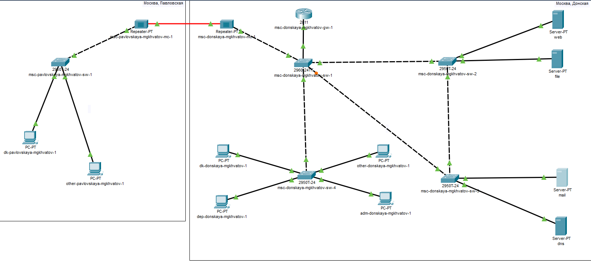{#fig:001 width=70%}

С оконечного устройства dk-donskaya-1 пропингуем серверы mail и web (рис. [-@fig:005]).

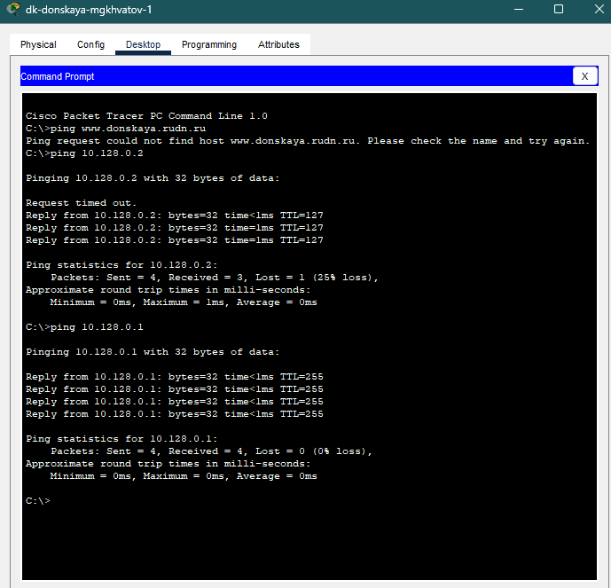{#fig:005 width=70%}

В режиме симуляции проследим движение пакетов ICMP. Убедимся, что движение пакетов происходит через коммутатор msk-donskaya-sw-2 (рис. [-@fig:006]). 

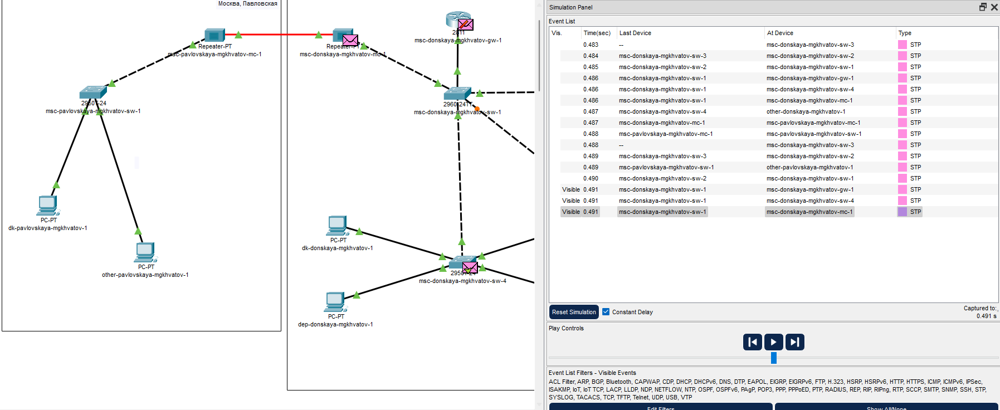{#fig:006 width=70%}

На коммутаторе msk-donskaya-sw-2 посмотрим состояние протокола STP для vlan 3 (рис. [-@fig:008]):

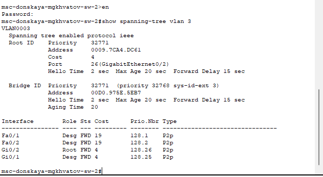{#fig:008 width=70%}

В качестве корневого коммутатора STP настроем коммутатор msk-donskaya-sw-1 (рис. [-@fig:009]):

{#fig:009 width=70%}

Используя режим симуляции, убедимся, что пакеты ICMP пойдут от
хоста dk-donskaya-1 до mail через коммутаторы msk-donskaya-sw-1 и mskdonskaya-sw-3, а от хоста dk-donskaya-1 до web через коммутаторы
msk-donskaya-sw-1 и msk-donskaya-sw-2 (рис. [-@fig:010]).

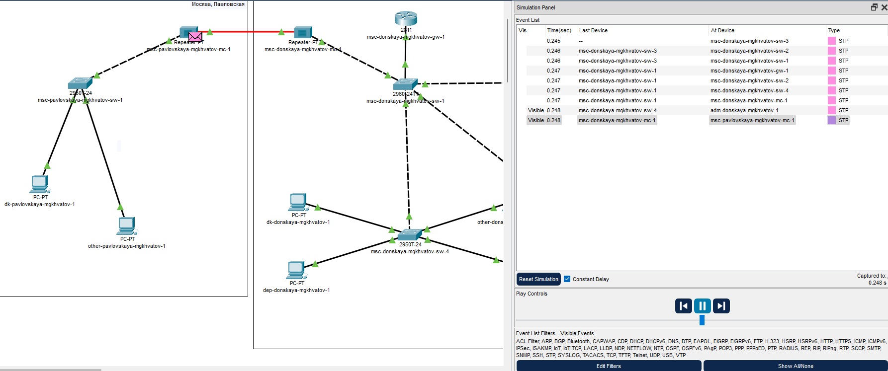{#fig:010 width=70%}

Настроим режим Portfast на тех интерфейсах коммутаторов, к которым
подключены серверы (рис. [-@fig:012]):

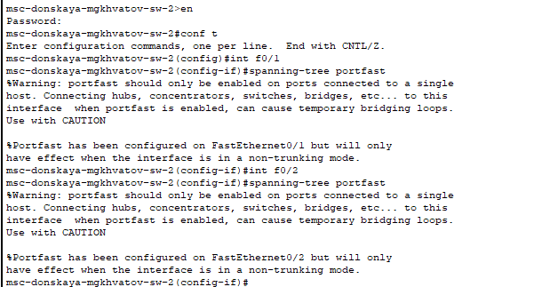{#fig:012 width=70%}

Изучим отказоустойчивость протокола STP и время восстановления соединения при переключении на резервное соединение. Для этого используем
команду `ping -n 1000 10.128.0.1` на хосте dk-donskaya-1,
а разрыв соединения обеспечим переводом соответствующего интерфейса
коммутатора в состояние shutdown. Произошел разрыв соединения в какой-то момент на 4 пинга, а после подключения всё восстановилось и потребовался один пинг.

Переключим коммутаторы в режим работы по протоколу Rapid PVST+ (рис. [-@fig:017,-@fig:018,-@fig:019,-@fig:020]):

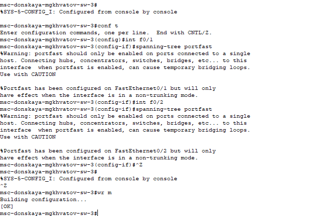{#fig:017 width=70%}

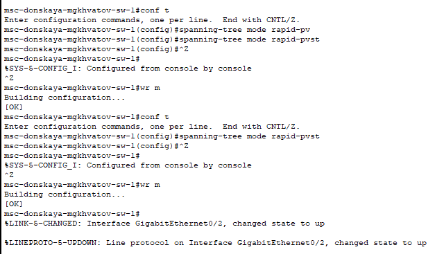{#fig:018 width=70%}

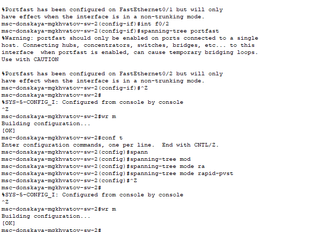{#fig:019 width=70%}

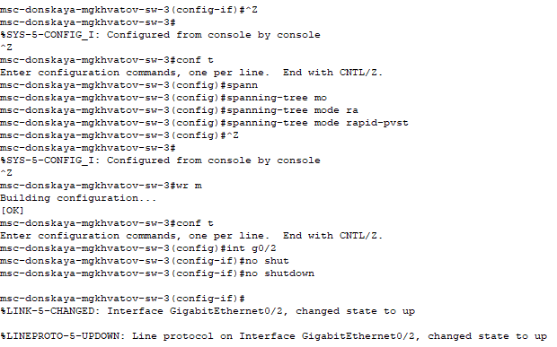{#fig:020 width=70%}

Изучим теперь отказоустойчивость протокола Rapid PVST+ и время восстановления соединения при переключении на резервное соединение.

Сразу после разрыва соединения задержки по времени вообще не было, сесть моментально перестроилась.

Сформируем агрегированное соединение интерфейсов Fa0/20 – Fa0/23
между коммутаторами msk-donskaya-sw-1 и msk-donskaya-sw-4 (рис. [-@fig:029]).

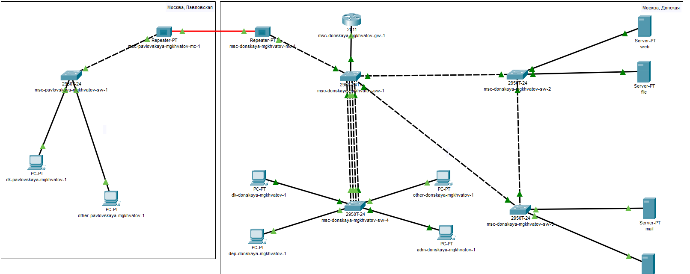{#fig:029 width=70%}

Красные стрелочки неожиланно исчезли при повторном вхоже в программу.

Настроим агрегирование каналов (режим EtherChannel) (рис. [-@fig:025--@fig:028]):

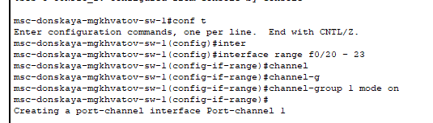{#fig:025 width=70%}

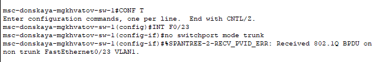{#fig:026 width=70%}

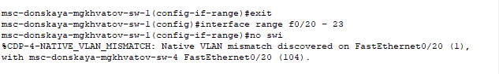{#fig:027 width=70%}

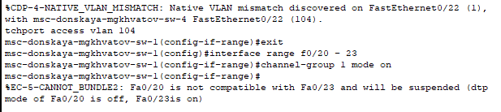{#fig:028 width=70%}

{width=70%}

# Выводы

В результате выполнения лабораторной работы я изучил возможности протокола STP и его модификаций по обеспечению
отказоустойчивости сети, агрегированию интерфейсов и перераспределению нагрузки между ними.

# Контрольные вопросы

1. Какую информацию можно получить, воспользовавшись командой определения состояния протокола STP для VLAN (на корневом и не на корневом устройстве)? Приведите примеры вывода подобной информации на устройствах.

С помощью этой команды вы можете просмотреть общую информацию о протоколе ST на коммутаторе. Вы можете просмотреть идентификатор Root, корневой мост и интерфейсные порты коммутатора, а также просмотреть состояния портов интерфейсов коммутатора.

Кроме того, если корневой мост настроен вручную, вы можете проверить значение приоритета коммутатора с помощью этой команды.

{#fig:030 width=70%}

2. При помощи какой команды можно узнать, в каком режиме, STP или
Rapid PVST+, работает устройство? Приведите примеры вывода подобной
информации на устройствах.

При помощи команды `show ru` просмотр текущей конфигурации.

3. Для чего и в каких случаях нужно настраивать режим Portfast?

Portfast -- функция, которая позволяет порту пропустить состояния listening и learning и сразу же перейти в состояние forwarding. Настраивается на портах уровня доступа, к которым подключены пользователи или сервера. Цель функции PortFast минимизировать время, которое необходимо для того чтобы порт перешел в состояние forward. Поэтому она эффективна только когда применена к портам, к которым подключены хосты.

4. В чем состоит принцип работы агрегированного интерфейса? Для чего он
используется?

Агрегирование каналов — это технология объединения нескольких параллельных каналов передачи данных в сетях Ethernet в один логический. Она позволяет увеличить пропускную способность и повысить надёжность.

Основное применение технологии агрегации — объединение каналов в сетевых коммутаторах. Также можно настроить агрегирование для компьютерных сетевых адаптеров.

5. В чём принципиальные отличия при использовании протоколов LACP (Link Aggregation Control Protocol), PAgP (Port Aggregation Protocol) и статического агрегирования без использования протоколов?

LACP и PAgP - динамические протоколы, управляющие созданием и управлением агрегированных соединений. Статическое агрегирование настраивается вручную без использования протоколов.

6. При помощи каких команд можно узнать состояние агрегированного канала
EtherChannel?

Команды `show etherchannel summary` и `show etherchannel port-channel`.